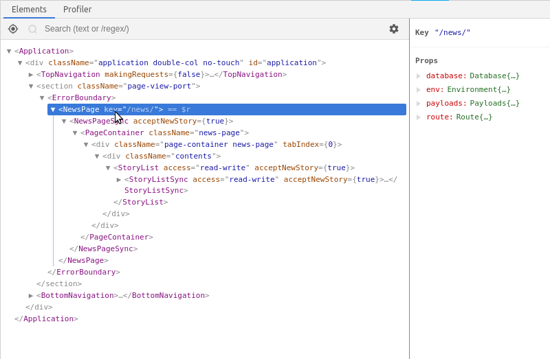
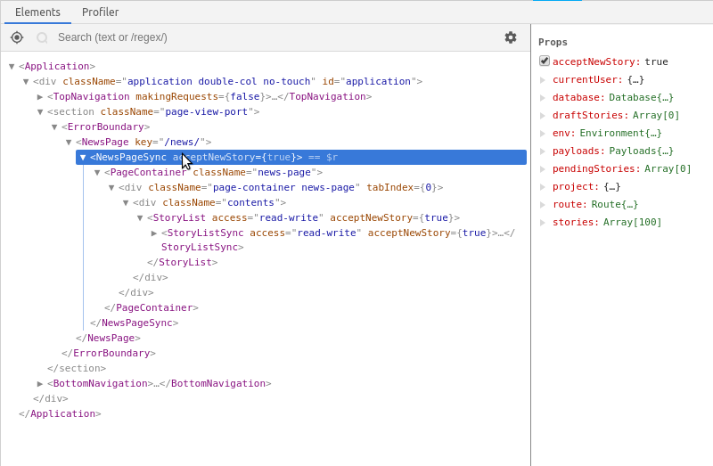
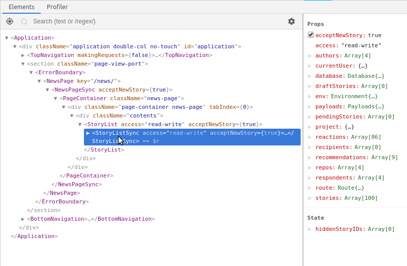
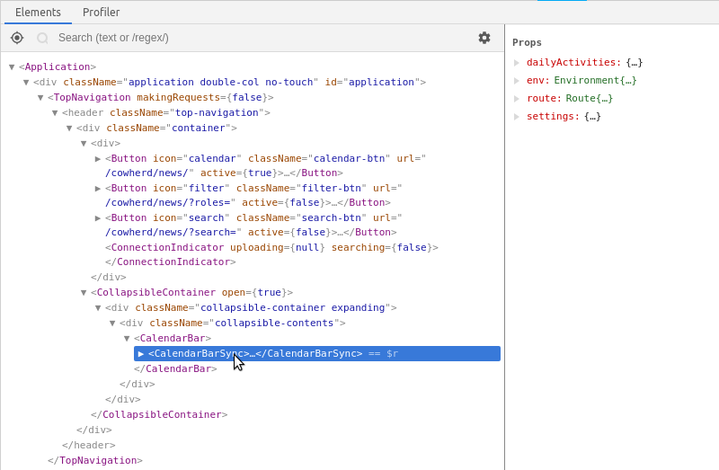

Relaks
------

Relaks is a minimalist library that give [React](https://reactjs.org/) components a [promise-based](https://promisesaplus.com/), asynchronous interface. Instead of `render()`, Relaks components implement `renderAsync()`, a method that returns a promise of a `ReactElement`. Asynchronous data retrieval can then be performed as part of the rendering sequence.

Relaks enables a simpler programming model. It's especially useful for web applications whose business logic reside largely on the server side.

* [Basic example](#basic-example)
* [Example with multiple async operations](#example-with-multiple-async-operations)
* [ES7 syntax](#es7-syntax)
* [Interruption of rendering](#interruption-of-rendering)
* [Progressive rendering delay](#progressive-rendering-delay)
* [Error handling](#error-handling)
* [Life-cycle functions](#life-cycle-functions)
* [Building a full application](#building-a-full-application)
* [API reference](#api-reference)
* [ES5 convention](#es5-convention)
* [Preact support](#preact-support)
* [Libraries & add-ons](#libraries--and-ons)
* [Examples](#example)
* [Questions](#questions)
* [License](#license)
* [Acknowledgement](#acknowledgement)

## Basic example

```javascript
import { AsyncComponent } from 'relaks';

class StoryView extends AsyncComponent {
    renderAsync(meanwhile) {
        let db = this.props.database;
        let storyURL = `/story/${this.props.storyID}/`;
        meanwhile.show(<div>Loading</div>);        
        return db.fetchOne(storyURL).then((story) => {
            return (
                <div>
                    <h1>{story.title}</h1>
                    <p>{story.text}</p>
                </div>
            );
        });
    }
}
```

The component above fetches a JSON object from a remote location and displays it's contents. While waiting for the data to arrive, it shows a loading message by calling `meanwhile.show()`. `meanwhile` is an interface object that lets you control how component behaves prior to the fulfillment of the returned promise. Generally this means showing something while asynchronous operations are in progress. By calling `meanwhile.show()` at various stages, a component can render itself progressively.

## Example with multiple async operations

```javascript
import { AsyncComponent } from 'relaks';

class StoryView extends AsyncComponent {
    renderAsync(meanwhile) {
        let db = this.props.database;
        let storyURL = `/stories/${this.props.storyID}/`;
        meanwhile.show(<div>Loading</div>);        
        return db.fetchOne(storyURL).then((story) => {
            meanwhile.show(
                <div>
                    <h1>{story.title}</h1>
                    <h2>Author: -</h2>
                    <h3>Category: -</h3>
                    <p>{story.text}</p>
                </div>
            );
            let authorURL = `/users/${story.author_id}/`;
            return db.fetchOne(authorURL).then((author) => {
                meanwhile.show(
                    <div>
                        <h1>{story.title}</h1>
                        <h2>Author: {author.name}</h2>
                        <h3>Category: -</h3>
                        <p>{story.text}</p>
                    </div>
                );

                let categoryURL = `/categories/${story.category_id}/`;
                return db.fetchOne(categoryURL).then((category) => {
                    return (
                        <div>
                            <h1>{story.title}</h1>
                            <h2>Author: {author.name}</h2>
                            <h3>Category: {category.name}</h3>
                            <p>{story.text}</p>
                        </div>
                    );
                });
            });
        });
    }
}
```

In the code above, `renderAsync()` first fetches the story object. It calls `meanwhile.show()` to render information that's immediately available, namely the story's title and text. The author and category names are not yet available, so we put dashes in their place, then we proceed to retrieve them. Once the related objects are retrieved, actual text replaces the dashes.

There's a great deal of redundant in the code. Typically it's advisable to put the UI code in a separate component:

```javascript
import { PureComponent } from 'react';
import { AsyncComponent } from 'relaks';

class StoryView extends AsyncComponent {
    renderAsync(meanwhile) {
        let db = this.props.database;
        let props = {
            story: undefined,
            author: undefined,
            category: undefined,
        };
        meanwhile.show(<StoryViewSync {...props} />);        
        return Promise.resolve().then(() => {
            let storyURL = `/stories/${this.props.storyID}/`;
            return db.fetchOne(storyURL).then((story) => {
                props.story = story;
            });
        }).then(() => {
            meanwhile.show(<StoryViewSync {...props} />);        
        }).then(() => {
            let authorURL = `/users/${props.story.author_id}`;
            return db.fetchOne(authorURL).then((author) => {
                props.author = author;
            });
        }).then(() => {
            meanwhile.show(<StoryViewSync {...props} />);        
        }).then(() => {
            let categoryURL = `/categories/${props.story.category_id}`;
            return db.fetchOne(categoryURL).then((category) => {
                props.category = category;
            });
        }).then(() => {
            return <StoryViewSync {...props} />;
        });
    }
}

class StoryViewSync extends PureComponent {
    render() {
        let { story, author, category } = this.props;
        if (!story) {
            return <div>Loading</div>;
        }
        return (
            <div>
                <h1>{story.title}</h1>
                <h2>Author: {author ? author.name : '-'}</h2>
                <h3>Category: {category ? category.name : '-'}</h3>
                <p>{story.text}</p>
            </div>
        );
    }
}
```

## ES7 syntax

The example above becomes a lot cleaner when we use the ES7 await operator:

```javascript
class StoryView extends AsyncComponent {
    async renderAsync(meanwhile) {
        let db = this.props.database;
        let props = {};
        meanwhile.show(<StoryViewSync {...props} />);        
        props.story = await db.fetchOne(`/stories/${this.props.storyID}/`);
        meanwhile.show(<StoryViewSync {...props} />);        
        props.author = await db.fetchOne(`/users/${props.story.author_id}`);
        meanwhile.show(<StoryViewSync {...props} />);
        props.category = await db.fetchOne(`/categories/${props.story.category_id}`);
        return <StoryViewSync {...props} />;
    }
}
```

## Interruption of rendering

When a Relaks component receives new props (or experiences a state change), its `renderAsync()` is called and a new rendering cycle starts. If the component was still in the middle of rendering--i.e. the promise returned earlier had not yet been fulfilled--this rendering cycle would be canceled. If `meanwhile.onCancel` is set, the function would be invoked at this point.

A call to `meanwhile.show()` in the defunct rendering cycle would trigger an `AsyncRenderingInterrupted` exception, breaking the promise chain. In the example above, if the component receives a new story ID while it's fetching the story, the second call to `meanwhile.show()` will throw. We won't end up wasting bandwidth fetching the author and category of a story we no longer need. Relaks will silently swallow the exception.  

## Progressive rendering delay

By default, progressive rendering will not start immediately. The promise returned by `renderAsync()` has a small window of time to fulfill itself. Only if it fails to do so would progressive rendering commerce. If it fulfills quickly (because everything in the promise chain is cached), then the calls to `meanwhile.show()` would produce no effect.

The default delay is 50ms during the initial rendering cycle and infinity in subsequent cycles. Basically, progressive rendering is turned off once a component manages to fully render itself. You can alter the delay intervals with a call to `meanwhile.delay()`. You can change the default values with calls to `Relaks.set()`.

For a very brief moment a Relaks component will be blank. If this causes layout or visual glitches, you can force Relaks to render the progress element initially by passing `'initial'` as the second parameter to `meanwhile.show()`. This needs to happen prior to any `await` operation (i.e. outside of callbacks to `.then()`). Example:

```javascript
class StoryView extends AsyncComponent {
    async renderAsync(meanwhile) {
        let db = this.props.database;
        let props = {};
        meanwhile.show(<StoryViewSync {...props} />, 'initial');
        props.story = await db.fetchOne(`/stories/${this.props.storyID}/`);
        meanwhile.show(<StoryViewSync {...props} />);        
        props.author = await db.fetchOne(`/users/${props.story.author_id}`);
        meanwhile.show(<StoryViewSync {...props} />);
        props.category = await db.fetchOne(`/categories/${props.story.category_id}`);
        return <StoryViewSync {...props} />;
    }
}
```

## Error handling

When a promise rejection is not explicitly handled in `renderAsync()`, Relaks will catch the rejection, force the component to refresh, then promptly throw the error object again inside its `render()` method. Doing so permits React's [error boundary](https://reactjs.org/docs/error-boundaries.html) mechanism to capture the error as it would errors occurring in synchronous code.

In the example above, if one of the requested objects does not exist, `db.fetchOne()` would throw asynchronously (i.e. rejection of the promise it has returned). If a component further up the tree has set an error boundary, the error would be caught there.

When there is no support for error boundaries (Preact, React 15 and below), Relaks will call an error handler instead. The default handler just dumps the error object into the JavaSCript console. Use `Relaks.set()` to set a custom handler.

## Life-cycle functions

`Relaks.AsyncComponent` implements `componentWillUnmount()` in order to monitor whether a component is still mounted. If you override it, be sure to call the parent implementation. Otherwise Relaks will attempt to redraw the component after it's been unmounted (which admittedly is harmless aside from triggering warnings from React).

`Relaks.AsyncComponent` also implements `shouldComponentUpdate()`. Shallow comparisons are done on a component's props and state to determine whether it needs to be rerendered. Override the method if you need more sophisticated behavior.

## Building a full application

Relaks is a simple, unopinionated component that can be used in a variety of situations. The following is a suggested model on how to build a complete application.


### Bootstrapping

Bootstrap code kick-starts an application. It's run right after the HTML page has loaded. It creates data providers, wait for them to become ready, then render the root React component into a DOM node. Here's the bootstrap code from [one of the example apps](https://github.com/chung-leong/relaks-starwars-example-sequel):

```javascript
async function initialize(evt) {
    // create remote data source
    let dataSource = new DjangoDataSource({
        baseURL: 'https://swapi.co/api',
    });
    dataSource.activate();

    // create route manager
    let routeManager = new RouteManager({
        useHashFallback: (process.env.NODE_ENV === 'production'),
        routes,
    });
    routeManager.activate();
    await routeManager.start();

    // render <Application />
    let appContainer = document.getElementById('app-container');
    if (!appContainer) {
        throw new Error('Unable to find app element in DOM');
    }
    let appElement = h(Application, { dataSource, routeManager });
    render(appElement, appContainer);
}
```

For an example of a more elaborate bootstrap sequence, see [app-core.js](https://github.com/chung-leong/trambar/blob/master/common/src/app-core.js) of the [Trambar](https://github.com/chung-leong/trambar) source code. The code does not merely initialize the data providers, it also handles interactions between them. Basically, it's responsible for the infrastructure needed by the React UI code.

### Data providers

A data provider is simply an object that provides data needed by the app. It can do so synchronously or asynchronously (i.e. through promise-returning methods). It'll typically be an event emitter. When a provider wishes to indicate that new data is available, it'll emit a `change` event.

An example of a synchronous data provider is [relaks-route-manager](https://github.com/chung-leong/relaks-route-manager). It extracts parameters from the browser's location. When the user clicks on a hyperlink or the back button, the current route changes. The route manager emits a `change` event and the application rerenders using new parameters extracted from the URL.

An example of an asynchronous data provider is [relaks-django-data-source](https://github.com/chung-leong/relaks-django-data-source). It retrieves data from a Django backend. It provides a set of `fetchXXX()` methods that return promises. When given an expiration interval, the data source will periodically invalidate cached results and emit a `change` event.

Data providers need not be coded specifically for Relaks. They're just classes that return data. They can be reused in other contexts (on the server side, for instance). The only requirement imposed by Relaks is the need for caching. Asynchronous methods should always return the same promise when give the same arguments unless the underlying data has changed. Otherwise a lot of redundant operations would occur whenever the app rerenders.

### Root-level component

`Application` is the root-level React component. It receives a set of data providers as props. In its constructor, it creates proxy objects around the data provider objects and save them into its state. These are then pass down the component tree in `render()` in lieu of the providers themselves. In `componentDidMount()`, `Application` attaches event handlers to the providers. When it receives a `change` event, it recreates the corresponding proxy. The call to `setState()` triggers rerendering. The `renderAsync()` methods of Relaks components are invoked, which in turn pulls in up-to-date data.

From [one of the examples](https://github.com/chung-leong/relaks-starwars-example-sequel):

```javascript
constructor(props) {
    super(props);
    let { routeManager, dataSource } = this.props;
    this.state = {
        route: new Route(routeManager),
        swapi: new SWAPI(dataSource),
    };
}
```

```javascript
render() {
    let { route, swapi } = this.state;
    let PageComponent = route.params.module.default;
    return (
        <div>
            <NavBar route={route} />
            <div className="contents">
                <PageComponent route={route} swapi={swapi} />
            </div>
        </div>
    );
}
```

```javascript
componentDidMount() {
    let { routeManager, dataSource } = this.props;
    routeManager.addEventListener('change', this.handleRouteChange);
    dataSource.addEventListener('change', this.handleDataSourceChange);
}
```

```javascript
handleDataSourceChange = (evt) => {
    this.setState({ swapi: new SWAPI(evt.target) });
}

handleRouteChange = (evt) => {
    this.setState({ route: new Route(evt.target) });
}
```

### Proxy objects

Proxy objects serve a number of purposes. First and foremost, they're used to trigger rerendering of [pure components](https://reactjs.org/docs/react-api.html#reactpurecomponent). Any component that extends `React.PureComponent` or `Relaks.AsyncComponent` is a pure component. Its render method is only called when a shallow comparison indicates that its props or state have changed. Recreation of proxy objects when `change` events occur triggers that, ensuring that new data is propagated through the component tree.

Proxy objects also insulate your code from third-party code. You can tailor them to fit your preferred convention and phraseology. For example, [relaks-django-data-source](https://github.com/chung-leong/relaks-django-data-source) provides a `fetchOne()` method that accepts an URL as parameter. Instead of calling this everywhere, you can implement a set of methods specific to your app's database schema. For example:

```javascript
class Database {
    constructor(dataSource) {
        this.dataSource = dataSource;
    }

    async getStoryByID(storyID) {
        return this.dataSource.fetchOne(`/stories/${storyID}`);
    }

    async getCategoryByID(catID) {
        try {
            if (catID) {
                return this.dataSource.fetchOne(`/categories/${catID}`);
            }
        } catch (err) {
            if (err.status === 404 && process.env.NODE_ENV !== 'production') {
                throw err;
            }
        }
        return defaultCategory;
    }

    /* ... */
}
```

The code above shows how you can implement certain pragmatics in a proxy object. For `getCategoryByID()`, we know that `catID` can be 0. In such an event we simply return a default category. We also choose to handle 404 error differently in the production environment. Instead of letting the error bubble up to an error boundary (leading to the unmounting of the component) we'd simply show the default when a category has gone missing.

Proxy objects make debugging easier. You can easily stick `console.log()` and conditional `debugger` statements into your own code. You can find your source file far more quickly than something deep inside `node_modules` (especially if you choose not to generate sourcemaps for libraries).

### Synchronous/Asynchronous pairs

When a component needs data from an asynchronous provider (e.g. remote database), it extends `Relaks.AsynComponent` and implements `renderAsync()`. It's generally advisable to place the code for fetching data in an asynchronous component and the code for drawing the user interface in a separate synchronous component. Doing so makes the code easier to debug and test. It also makes it easier to divide work among multiple programmers. Someone familiar with the backend code could work on the asynchronous part while someone else more comfortable with UI design can focus on the synchronous part.

The following is a screen-cap of the [React Developer Tools](https://chrome.google.com/webstore/detail/react-developer-tools/fmkadmapgofadopljbjfkapdkoienihi?hl=en) showing the component tree of the [Trambar client app](https://github.com/chung-leong/trambar/blob/master/docs/demo.md). You can see that two of the components come in async/sync pairs:



`NewsPage` is the app's news feed page. It extends `Relaks.AsyncComponent`. Note on the right how it has received four proxy objects from `Application`. Its only child `NewsPageSync` is shown below:



`NewsPageSync` extends `React.PureComponent`. Note how it has received these additional props: `stories`, `draftStories`, `pendingStories`. The component passes the story objects to `StoryList`:


`StoryList` is another asynchronous component. Just having the story objects isn't enough: we also need the authors and people's reactions to the stories. `StoryList` would fetch these and give them to `StoryListAsync`:



`StoryListAsync` expects the props `authors`, `reactions`, `respondents`, `recommendations`, and `recipients`. It can fully render the stories once all these become available. Initially it only has the story objects. That's enough to show their most visible part, namely the story contents. The other parts would appear progressively as `StoryList` fetches them.

Async/sync pairs are also used in the top navigation:



The calendar bar needs the project's daily statistics in order to know which dates to highlight and make available as clickable links:


## API reference

* [Methods](#methods)
  * [meanwhile.check](#meanwhilecheck)
  * [meanwhile.delay](#meanwhiledelay)
  * [meanwhile.revising](#meanwhilerevising)
  * [meanwhile.show](#meanwhileshow)
  * [Relaks.set](#relaksset)

* [Event handlers](#event-handlers)
  * [meanwhile.onCancel](#meanwhileoncancel)
  * [meanwhile.onComplete](#meanwhileoncomplete)
  * [meanwhile.onProgress](#meanwhileonprogress)

* [Properties](#properties)
  * [meanwhile.current](#meanwhilecurrent)
  * [meanwhile.previous](#meanwhileprevious)
  * [meanwhile.prior](#meanwhileprior)

### Methods

#### meanwhile.check

```typescript
function check(): void
```

Check if the rendering cycle has been superceded by a new one. If so throw an exception to end it. It ensures the component is mounted as well. Generally you would use `meanwhile.show()` instead.

#### meanwhile.delay

```typescript
function delay(empty: number, rendered: number): void
```

Set progressive rendering delay, for when the component is empty and when it has fully rendered previously. When a parameter is `undefined`, it's ignored.

#### meanwhile.revising

```typescript
function revising(): boolean
```

Return true if the component has previously been fully rendered.

#### meanwhile.show

```typescript
function show(element: ReactElement, disposition: string): boolean
```

Render an element while awaiting the completion of asynchronous operations, possibly after a delay. Use `disposition` to force immediate rendering. When it's `'always'`, the element is always rendered. When it's `'initial'`, the element is rendered if the component would otherwise be empty.

A return value of `false` means rendering is being deferred.

This method calls `meanwhile.check()` to ascertain that the rendering cycle is still valid.

#### Relaks.set

```typescript
function set(name: string, value: any): void
```

Set one of Relaks's global parameters. `name` can be one of the following:

* **delayWhenEmpty** - The amount of time given to promises returned by `renderAsync()` before contents passed to `meanwhile.show()` appears when nothing has been rendered yet. In milliseconds. The default is 50.
* **delayWhenRendered** - The time allowance when the component has fully rendered previously. The default is infinity.
* **errorHandler** - Error handler used when there is no support for error boundaries. The default is `console.error()`.

### Event handlers

Relaks will call event handlers attached to the meanwhile object at certain points during the rendering cycle. They're useful for debugging and optimization.

#### meanwhile.onCancel

Triggered when a rendering cycle is canceled.

#### meanwhile.onComplete

Triggered when a render cycle is coming to an end, after the promise returned by `renderAsync` is fulfilled, but prior to the contents is rendered.

#### meanwhile.onProgress

Triggered when a contents passed to `meanwhile.show()` is about to be rendered. The event object will have an `elapsed` property, giving the number of milliseconds elapsed since the start of the rendering cycle.

### Properties

The following properties are provided mainly for debugging purpose.

#### meanwhile.current

An object containing component's current props and state.

#### meanwhile.previous

An object containing component's previous props and state.

#### meanwhile.prior

An object containing component's props and state prior to rerendering. It will be the same as `meanwhile.previous` unless the previous rendering cycle was interrupted, in which case `previous` would have the props and state of the interrupted cycle, while `prior` would have those of the last completed cycle.

## ES5 convention

Relaks supports the older method of creating a component:

```javascript
var Relaks = require('relaks/legacy');

module.exports = Relaks.createClass({
    displayName: 'StoryView',

    renderAsync: function(meanwhile) {
        /* ... */
    },
});
```

## Preact support

Relaks has built-in support for [Preact](https://preactjs.com/). Simply import from 'relaks/preact' instead of 'relaks'. `renderAsync()` will receive `props`, `state`, and `context` in addition to the meanwhile object.

Import from `'relaks/preact'` instead of `'relaks'`:

```javascript
import { h, Component } from 'preact';
import { AsyncComponent } from 'relaks/preact';

/** @jsx h */
```

## Libraries & add-ons

* [relaks-route-manager](https://github.com/chung-leong/relaks-route-manager) - route manager
* [relaks-django-data-source](https://github.com/chung-leong/relaks-django-data-source) - retrieves data through Django REST API
* [relaks-harvest](https://github.com/chung-leong/relaks-harvest) - library used for server-side rendering (SSR)
* [relaks-event-emitter](https://github.com/chung-leong/relaks-event-emitter) - event emitter designed with asynchronous code in mind

## Examples

* [Starwars API](https://github.com/chung-leong/relaks-starwars-example-sequel) - a simple example that fetches data from [SWAPI.co](SWAPI.co)
* [Starwars API: Episode V](https://github.com/chung-leong/relaks-starwars-example-sequel) - sequel to the first Starwars API example
* [Starwars API: Episode VI - The Server Strikes Back](https://github.com/chung-leong/relaks-starwars-example-isomorphic) - demonstrates how to create an isomorphic app
* [Django todo list](https://github.com/chung-leong/relaks-django-todo-example) - demonstrates authentication and data saving using [relaks-django-data-source](https://github.com/chung-leong/relaks-django-data-source)

* [Trambar](https://trambar.io) - a real-world social app for which Relaks was created

## Questions

If you have questions concerning Relaks, feel free to contact me by [e-mail](chernyshevsky@hotmail.com). You can also post your question at [Stack Overflow](https://stackoverflow.com/). I'm actively tracking the "relaks" tag.

You can follow the development of projects related to Relaks at my [Trambar](https://live.trambar.io/).

## License

This project is licensed under the MIT License - see the [LICENSE](#LICENSE) file for details

## Acknowledgement

Relaks is named after a [bar in Krakow, Poland](https://www.google.pl/maps/place/Relaks+craftbeer+%26+food/@50.0626813,19.941311,18.08z/data=!4m5!3m4!1s0x47165b11a033a251:0x16ac7571f9bb26c!8m2!3d50.0622392!4d19.9422542?hl=en).


